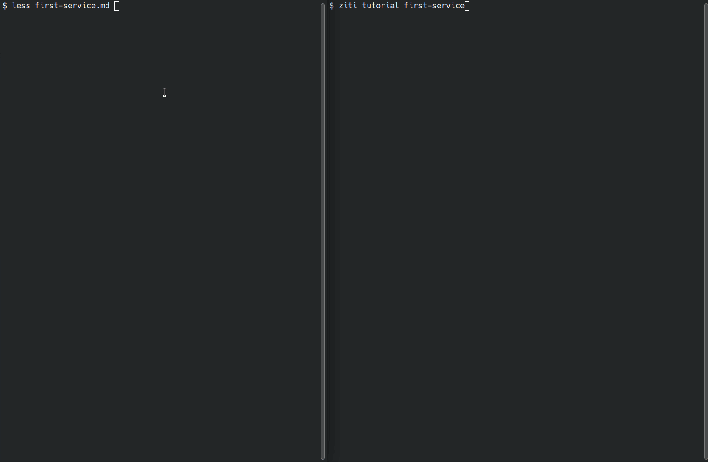

# runzmd

A Go library for making runnable markdown tutorials, demos and setup scripts.
It takes inspiration from the [Literate Programming](https://en.wikipedia.org/wiki/Literate_programming)
paradigm.

The library is used by the [OpenZiti](https://github.com/openziti/ziti) project
for tutorials and examples.

## Overview

runzmd exists to help consolidate scripts and documentation. If you can
make a markdown tutorial runnable, then you get the following benefits:

1. Testable documentation
2. No duplication between the tutorial and the script
3. Well documented, easy to read script
4. Documentation can be run or viewed in browzer. Browzer view isn't degraded by runnable code portions.

## Where It Makes Sense

While this library could be used for generalized scripts, it excels when
wrapping a specific tool. The OpenZiti examples mostly use the `ziti` CLI.
The actions used can be found in the actionz directory.

While this library could be used for generalized scripting it hasn't been
optimized for that, and best suited for targeted use cases, like the above.

## In Action

Here's an example of a markdown file being run. This is the
 [creating your first service](https://github.com/openziti/ziti/blob/v0.26.10/ziti/cmd/ziti/cmd/tutorial/tutorials/first-service.md)
 tutorial for [OpenZiti](https://github.com/openziti/ziti), which is the most 
involved example I have.  Below you can see the original markdown is on the left. 
On the right is the markdown being executed. The markdown 
[viewed in the browser](https://github.com/openziti/ziti/blob/v0.26.10/ziti/cmd/ziti/cmd/tutorial/tutorials/first-service.md) 
should still be usable on its own.



## How It Works

runzmd starts with embedded markdown and finds any blockquote sections and
comments marked as being executable. Markdown sections between executable
blocks are outputted it using the [go-term-markdown](github.com/MichaelMure/go-term-markdown)
library. The executable sections are handed off to registered handlers, to
executable in whatever manner is appropriate.

There is a small example in the [example](./example/) directory which
just runs the `ls` command.

It looks like this:

````markdown
# Example

This is an example

```action:exec
ls
```
````

The go code to run this example markdown, looks like this:

```go
package main

import (
	_ "embed"
	"fmt"
	"github.com/openziti/runzmd"
	"time"
)

//go:embed example.md
var scriptSource []byte

func main() {
	t := runzmd.NewRunner()
	t.NewLinePause = time.Millisecond * 20
	t.AssumeDefault = false

	t.RegisterActionHandler("exec", &runzmd.ExecActionHandler{})

	if err := t.Run(scriptSource); err != nil {
		fmt.Printf("failure running example: [%v]\n", err)
	}
}
```

### What's in the Box?

The library comes with a few actions.

* ExecActionHandler - supports executing a list of commands
* ShowActionHandler - supports showing some text, usually an embedded file

The library also has a few useful utility functions, which can
be used in building custom actions.

* `Continue` - Used for waiting in interactive scripts
* `Exec` - Used to execute a command
* `AskYesNo` - Asks a yes/no question
* `AskYesNoWithDefault` - Asks a yes/no question with a default answer
* `Ask` - Asks for string response


